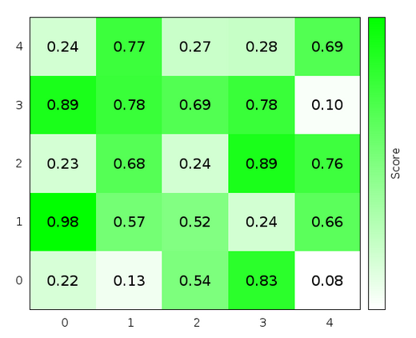

Лабораторная работа №2. Двумерные массивы и указатели

-   Сделать задачи из темы "двумерные массивы"
    > [[https://stepik.org/lesson/13026]{.underline}](https://stepik.org/lesson/13026)
    > по вариантам, но использовать отдельные функции для всех операций
    > (чтение, печать) и продемонстрировать на разных задачах 4 способа
    > хранения массивов в памяти:

1.  Массив фиксированного размера (например int\[50\]\[50\])

2.  vector\<vector\<int\>\> (рассказать, чем отличается передача в
    > функцию по ссылке и по значению)

3.  Хранение матрицы в одномерном массиве (например int\*) и обращение
    > по вычисляемому индексу

4.  Двойной указатель (int\*\*) с ручным выделением памяти и её очисткой

-   Как минимум к двум разным типам данных в программе в аргументах
    > функции написать const и обосновать, зачем :)

Индивидуальные варианты:

Все делаем задачи №3 и №4 со stepik c
[[https://stepik.org/lesson/13026/step/3]{.underline}](https://stepik.org/lesson/13026/step/3)
и далее следующие номера step по списку:

  --------------------------------------------------------------------------
  № по списку    задача A       задача B       задача C       задача D (моя)
  -------------- -------------- -------------- -------------- --------------
  1              5              8              12             M1

  2              6              10             13             M2

  3              7              10             14             M3

  4              5              11             15             M4

  5              6              9              12             M5

  6              7              8              13             M1

  7              5              10             14             M2

  8              6              11             15             M3

  9              7              8              12             M4

  10             5              10             13             M5

  11             6              8              14             M1

  12             7              11             15             M2

  13             5              8              12             M3

  14             6              11             13             M4

  15             7              9              14             M5

  16             5              9              15             M1

  17             6              8              12             M2

  18             7              10             13             M3

  19             6              9              14             M4

  20             5              1              15             M5

  21             7              9              12             M1

  22             6              11             12             M2

  23             5              10             14             M3

  24             7              9              15             M4

  25             6              10             12             M5

  26             5              11             13             М1
  --------------------------------------------------------------------------

Мои задачи (каждому по одной, см. таблицу выше)

(если уже решили все 13 задач Stepic, можно не решать)

Считать из файла массив из чисел 0 и 1. Формат файла:

3 4

0010

0110

1110

(без пробелов, считывайте строку string n раз и просматривайте её m
символов, перекладывая в vector\<vector\>)

М1 Найти столбец и строку массива с наибольшим числом единиц и добавить
ко всем значениям этих строк и столбцов +100. Если таких строк/столбцов
несколько, выбрать с максимальным номером

М2 Найти две самых дальних друг от друга единицы в массива (полным
перебором, без оптимизаций), заменить их на число 5

М3 Найти в массиве самый большой по площади прямоугольник из 1 (можно
простым перебором, для продвинутых - динамическим программированием)

М4 Найти расстояние между двумя самыми близкими единицами в массиве
(если не будет соседних, оно будет больше 1)

М5 Найти в массиве все столбцы из из 1, целиком окруженных нулями или
границами массива, напечатать их координаты начала и длины. Например,
для массива

5 5

10000

10101

00100

00100

должно напечатать

0 0 1

1 2 3 (3 вниз от 1,2)

1 4 1

По желанию нарисовать содержимое массива, сохранив его в текстовый файл:

a\[0\]\[0\] a\[0\]\[1\] a\[0\]\[2\] a\[0\]\[m-1\]

a\[1\]\[0\] a\[1\]\[1\] a\[1\]\[2\]

a\[n-1\]\[0\] a\[n-1\]\[1\] a\[n-1\]\[m-1\]

Пример показа матрицы в виде изображения: скрипт для gnuplot
showMatrix.plt\
[[https://stackoverflow.com/questions/32458753/gnuplot-2d-plot-of-a-matrix-of-data]{.underline}](https://stackoverflow.com/questions/32458753/gnuplot-2d-plot-of-a-matrix-of-data)

reset

set autoscale fix

set palette defined (0 \'white\', 1 \'green\')

set tics scale 0

unset cbtics

set cblabel \'Score\'

unset key

plot \'data.txt\' matrix with image,\'\' matrix using
1:2:(sprintf(\'%.2f\', \$3)) with labels font \',16\'

{width="4.421875546806649in"
height="3.5885214348206476in"}
